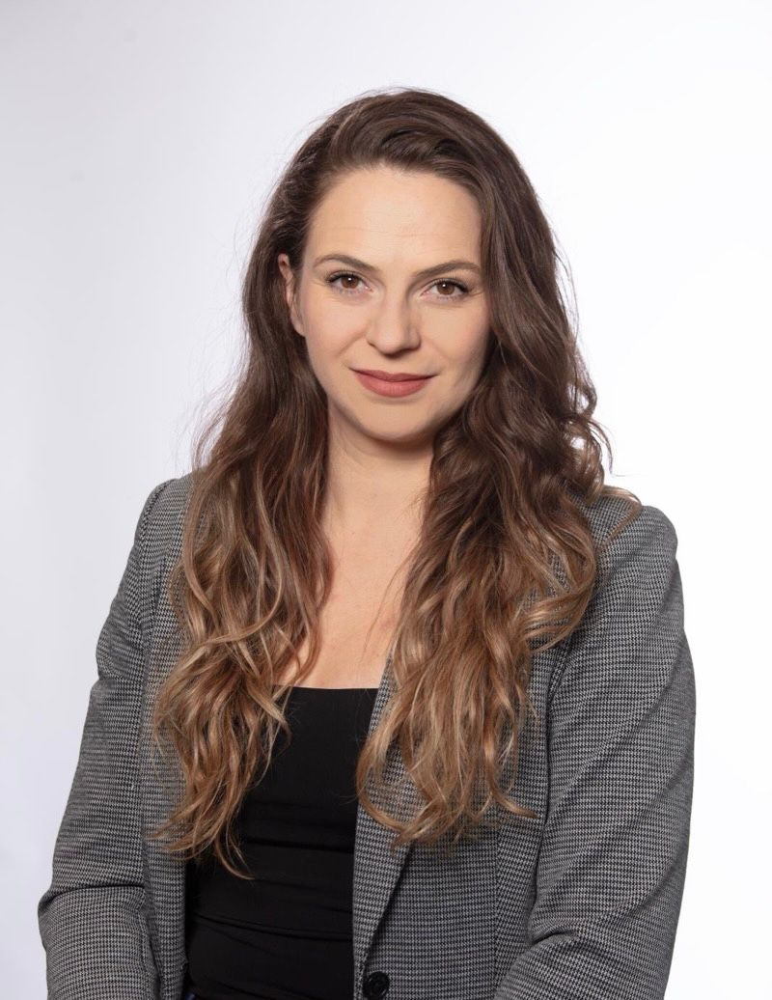

::: {.about-grid}

::: {}
{.profile-img fig-alt="Marisa Schmidt Bazzi"}

<ul class="contact-list">
<li>📍 Palo Alto, CA</li>
<li>✉️ [msbazzi@stanford.edu](mailto:msbazzi@stanford.edu)</li>
<li>🎓 [Google Scholar](https://scholar.google.com/citations?user=GyhokJYAAAAJ)</li>
<li>💻 [GitHub](https://github.com/msbazzi)</li>
<li>🔗 [LinkedIn](https://www.linkedin.com/in/marisa-bazzi/)</li>
</ul>
:::

::: {}
## About

I am a **Postdoctoral Scholar** at Stanford University, Department of Pediatrics,
working at the intersection of **vascular biomechanics**, **scientific machine
learning**, and **patient-specific simulation**.

My research combines mechanistic modeling — finite element analysis, computational
fluid dynamics, fluid–structure interaction, and growth-and-remodeling theory —
with data-driven techniques such as constitutive neural networks and symbolic
regression. I apply these tools to multimodal clinical data (MRI, IVUS,
catheterization) to predict cardiovascular disease progression and guide the
design of tissue-engineered vascular grafts.

I contribute to the open-source [SimVascular](https://simvascular.github.io/)
platform and build reproducible Python and C++ workflows for high-performance
computing environments.

I earned my Ph.D. in Materials Science from the University of Minnesota under
[Victor Barocas](https://cems.umn.edu/profiles/victor-barocas), and previously
trained in Mechanical Engineering at PUC-Rio.

:::

:::

## Research interests

- **Vascular biomechanics & growth and remodeling** — aneurysm progression, tissue-engineered vascular grafts
- **Scientific machine learning** — constitutive neural networks, symbolic regression, physics-informed surrogates
- **Multimodal medical imaging** — IVUS, MRI, catheterization-driven simulation pipelines
- **Multiphysics simulation** — FEA / CFD / FSI coupling, fluid–solid–growth (FSG) modeling
- **Open-source scientific software** — contributions to SimVascular, svFSI, svFSG, svMultiPhysics

## Recent news

- **2026/04** — New paper out in *Computers in Biology and Medicine* on aortic hemodynamics and Marfan syndrome.
- **2025** — Selected as a **Rising Star in Computational and Data Science** (Oden Institute, UT Austin).
- **2025** — Awarded the **CHIP T32 Training Grant**.
- **2024** — Awarded the **Baker Postdoctoral Fellowship** at Stanford.
