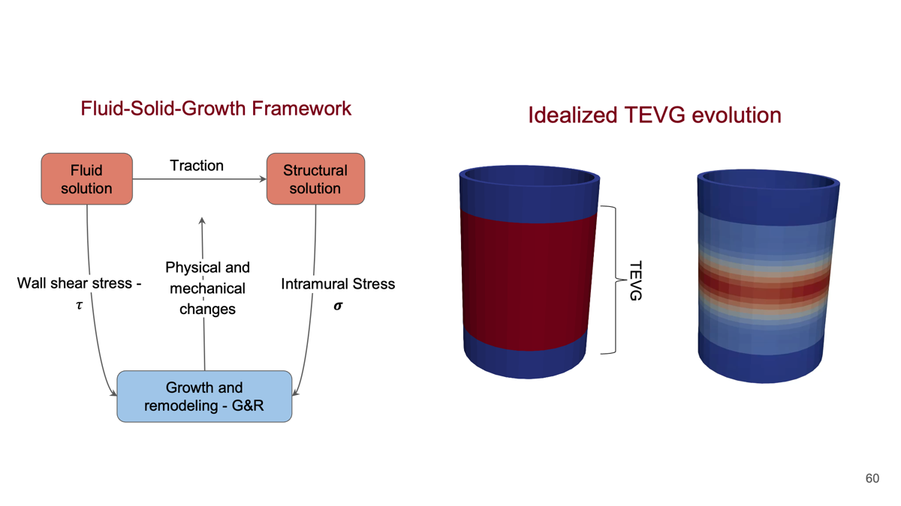
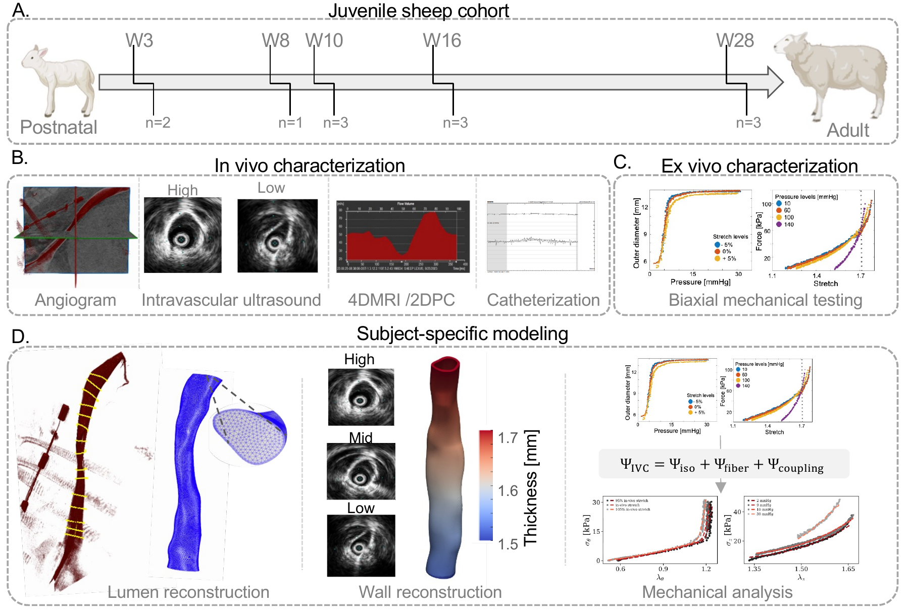
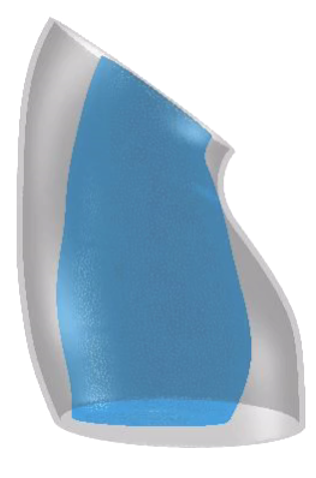
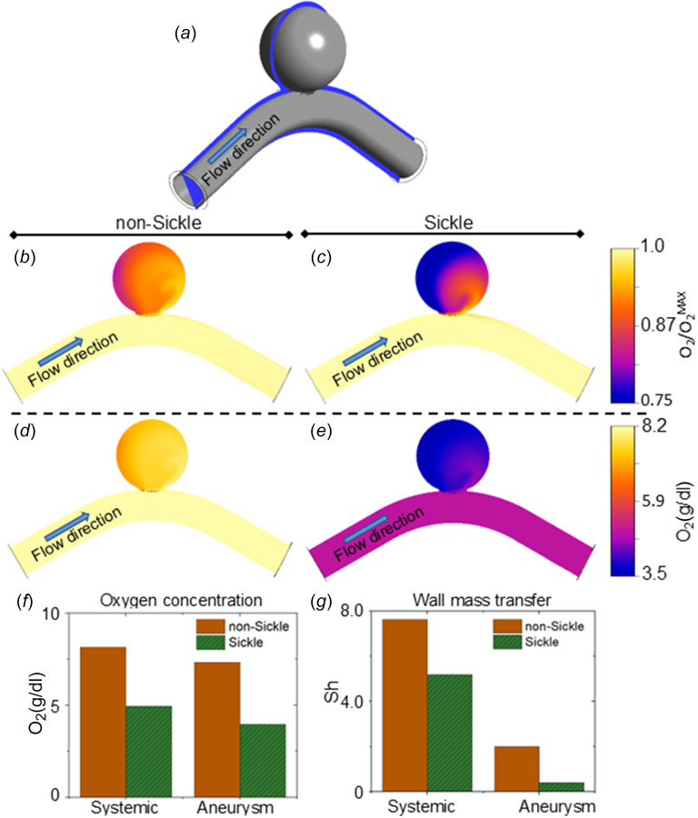
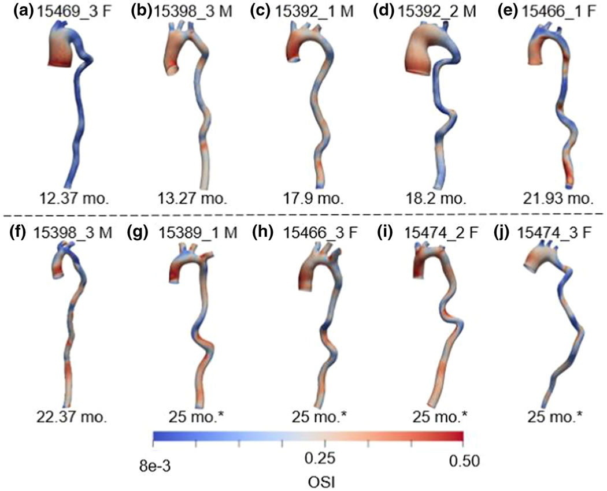
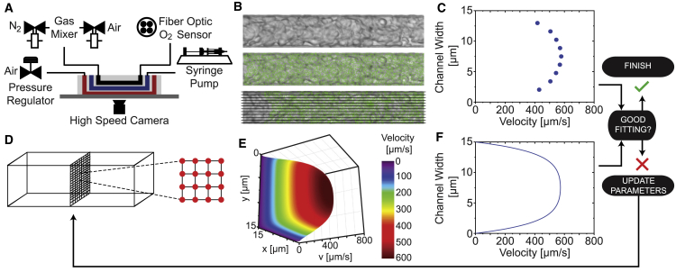

Selected studies and ongoing research connecting cardiovascular mechanics, computational modeling, and experiments.

:::: {.paper-projects}

::: {.paper-project #tevg-fluid-solid-growth}

::: {.paper-project-content}

[Ongoing research]{.paper-project-status}

## Predicting tissue-engineered vascular graft remodeling

Tissue-engineered vascular grafts could grow with a child, but excessive tissue formation can cause narrowing. I am developing a framework that combines interpretable, physics-constrained machine learning with subject-specific fluid–solid–growth simulations to predict how these grafts remodel. Using longitudinal experimental data, the project aims to identify shared remodeling laws that connect scaffold properties, blood flow, wall mechanics, and tissue formation. The goal is to predict stenosis risk and virtually screen graft designs to guide the development of growing vascular replacements for children with congenital heart disease.

:::
:::

::: {.paper-project #vein-mechanics}

::: {.paper-project-content}

[Submitted]{.paper-project-status}

## Learning the mechanical behavior of veins

How can we describe the complex mechanical behavior of veins with a compact, interpretable model? We combine biaxial testing with constitutive neural networks to discover strain-energy functions that capture venous mechanics and can be used in computational simulations.

::: {.paper-project-citation}
**Data-driven discovery of constitutive models for vein mechanics using constitutive neural networks**  
Bazzi MS, Adil D, Humphrey JD, Marsden AL.
:::

*Manuscript submitted.*
:::
:::

::: {.paper-project #ivc-development}

::: {.paper-project-content}

[Submitted]{.paper-project-status}

## How veins grow during development

As the body grows, veins must adapt to changing size and circulatory demands. This study combines imaging, hemodynamic measurements, and mechanical testing in juvenile sheep to characterize how inferior vena cava geometry and function evolve during development.

::: {.paper-project-citation}
**Experimental–computational characterization of somatic growth of the inferior vena cava in juvenile sheep**  
Bazzi MS et al.
:::

*Manuscript submitted.*
:::
:::

::: {.paper-project #aortic-growth}

::: {.paper-project-content}

[Published · 2025]{.paper-project-status}

## Modeling aortic aneurysm growth

Can a shared set of growth laws explain how an aneurysm develops? We use computational models to connect blood flow, vessel mechanics, and arterial remodeling, testing whether uniform growth laws can reproduce aspects of ascending aortic aneurysm progression in a mouse model.

::: {.paper-project-citation}
**Ascending aortic aneurysm growth in the Fbln4SMKO mouse is consistent with uniform growth laws**  
Bazzi MS, Wiputra H, Guan W, Barocas VH. Biomechanics and Modeling in Mechanobiology.
:::

[Read paper](https://doi.org/10.1007/s10237-025-01972-5){.btn .btn-outline-primary}
:::
:::

::: {.paper-project #aneurysm-oxygen}

<figure class="paper-project-media">

<figcaption>Oxygen availability in nonsickle and sickle-cell aneurysm simulations. <a href="https://pmc.ncbi.nlm.nih.gov/articles/PMC11748962/#F3" target="_blank" rel="noopener">Bazzi et al., 2025, Fig. 3</a>.</figcaption>
</figure>

::: {.paper-project-content}

[Published · 2025]{.paper-project-status}

## Oxygen transport inside cerebral aneurysms

Blood-flow patterns influence how oxygen reaches an aneurysm wall. We couple flow and transport simulations to investigate oxygen availability within intracranial aneurysms and how the altered blood properties associated with sickle-cell disease may affect this environment.

::: {.paper-project-citation}
**Computational analysis of flow and transport suggests reduced oxygen levels within intracranial aneurysms, especially in individuals with sickle-cell disease**  
Bazzi MS, Wiputra H, Wood DK, Barocas VH. Journal of Biomechanical Engineering.
:::

[Read paper](https://doi.org/10.1115/1.4067323){.btn .btn-outline-primary}
:::
:::

::: {.paper-project #aneurysm-biomarkers}

<figure class="paper-project-media">

<figcaption>Mouse-specific aortic models and oscillatory shear index. <a href="https://pmc.ncbi.nlm.nih.gov/articles/PMC9304450/#F4" target="_blank" rel="noopener">Bazzi et al., 2022, Fig. 4</a>.</figcaption>
</figure>

::: {.paper-project-content}

[Published · 2022]{.paper-project-status}

## Finding mechanical markers of aneurysm outcomes

Aneurysm geometry and blood flow may provide clues about disease outcomes. We build mouse-specific computational models to investigate geometric and biofluidic measures as candidate biomarkers of ascending thoracic aortic aneurysms.

::: {.paper-project-citation}
**Experimental and mouse-specific computational models of the Fbln4SMKO mouse to identify potential biomarkers for ascending thoracic aortic aneurysm**  
Bazzi MS, Balouchzadeh R, Pavey SN, et al. Cardiovascular Engineering and Technology.
:::

[Read paper](https://doi.org/10.1007/s13239-021-00600-4){.btn .btn-outline-primary}
:::
:::

::: {.paper-project #sickle-cell-rheology}

<figure class="paper-project-media">

<figcaption>Connecting microfluidic blood-flow measurements to a rheological model. <a href="https://pmc.ncbi.nlm.nih.gov/articles/PMC7732763/#fig1" target="_blank" rel="noopener">Bazzi et al., 2020, Fig. 1</a>.</figcaption>
</figure>

::: {.paper-project-content}

[Published · 2020]{.paper-project-status}

## From blood rheology to patient-specific flow

How do changes in blood rheology translate into changes in circulation? We combine experimental measurements with computational modeling to quantify patient-specific blood properties and investigate their consequences for systemic blood flow in sickle cell disease.

::: {.paper-project-citation}
**An Experimental-Computational Approach to Quantify Blood Rheology in Sickle Cell Disease**  
Bazzi MS, Valdez JM, Barocas VH, Wood DK. Biophysical Journal.
:::

[Read paper](https://doi.org/10.1016/j.bpj.2020.10.011){.btn .btn-outline-primary}
:::
:::

::::
