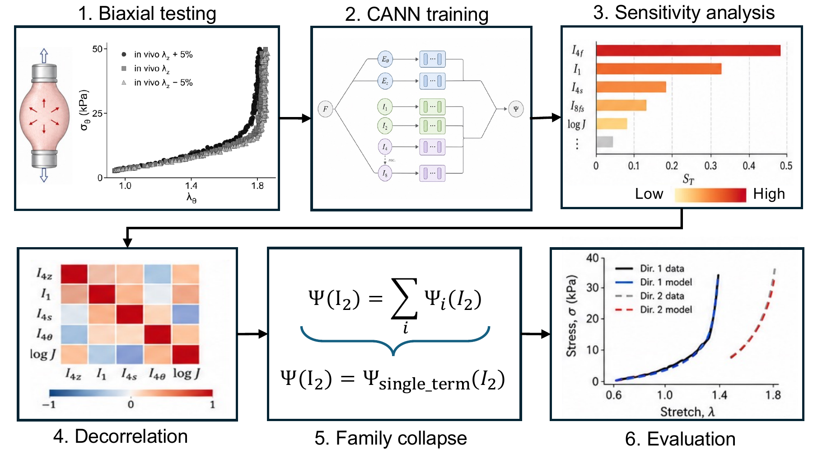

Selected studies connecting cardiovascular mechanics, computational modeling, and experiments. Each project highlights the question behind a paper.

:::: {.paper-projects}

::: {.paper-project #vein-mechanics}

::: {.paper-project-content}

[Submitted]{.paper-project-status}

## Learning the mechanical behavior of veins

How can we describe the complex mechanical behavior of veins with a compact, interpretable model? We combine biaxial testing with constitutive neural networks to discover strain-energy functions that capture venous mechanics and can be used in computational simulations.

::: {.paper-project-citation}
**Data-driven discovery of constitutive models for vein mechanics using constitutive neural networks**  
Bazzi MS, Adil D, Humphrey JD, Marsden AL.
:::

*Manuscript submitted.*
:::
:::

::: {.paper-project #ivc-development}

Image or video coming soon

<!-- Suggested visual: Age-dependent IVC geometry, imaging montage, or flow animation. Replace the pending media block with a figure with descriptive alt text, or a video with controls and preload="metadata". -->

::: {.paper-project-content}

[Submitted]{.paper-project-status}

## How veins grow during development

As the body grows, veins must adapt to changing size and circulatory demands. This study combines imaging, hemodynamic measurements, and mechanical testing in juvenile sheep to characterize how inferior vena cava geometry and function evolve during development.

::: {.paper-project-citation}
**Experimental–computational characterization of somatic growth of the inferior vena cava in juvenile sheep**  
Bazzi MS et al.
:::

*Manuscript submitted.*
:::
:::

::: {.paper-project #aortic-growth}

Image or video coming soon

<!-- Suggested visual: Aortic growth animation or longitudinal geometry comparison. Replace the pending media block with a figure with descriptive alt text, or a video with controls and preload="metadata". -->

::: {.paper-project-content}

[Published · 2025]{.paper-project-status}

## Modeling aortic aneurysm growth

Can a shared set of growth laws explain how an aneurysm develops? We use computational models to connect blood flow, vessel mechanics, and arterial remodeling, testing whether uniform growth laws can reproduce aspects of ascending aortic aneurysm progression in a mouse model.

::: {.paper-project-citation}
**Ascending aortic aneurysm growth in the Fbln4SMKO mouse is consistent with uniform growth laws**  
Bazzi MS, Wiputra H, Guan W, Barocas VH. Biomechanics and Modeling in Mechanobiology.
:::

[Read paper](https://doi.org/10.1007/s10237-025-01972-5){.btn .btn-outline-primary}
:::
:::

::: {.paper-project #aneurysm-oxygen}

Image or video coming soon

<!-- Suggested visual: Oxygen concentration map or oxygen-transport animation. Replace the pending media block with a figure with descriptive alt text, or a video with controls and preload="metadata". -->

::: {.paper-project-content}

[Published · 2025]{.paper-project-status}

## Oxygen transport inside cerebral aneurysms

Blood-flow patterns influence how oxygen reaches an aneurysm wall. We couple flow and transport simulations to investigate oxygen availability within intracranial aneurysms and how the altered blood properties associated with sickle-cell disease may affect this environment.

::: {.paper-project-citation}
**Computational analysis of flow and transport suggests reduced oxygen levels within intracranial aneurysms, especially in individuals with sickle-cell disease**  
Bazzi MS, Wiputra H, Wood DK, Barocas VH. Journal of Biomechanical Engineering.
:::

[Read paper](https://doi.org/10.1115/1.4067323){.btn .btn-outline-primary}
:::
:::

::: {.paper-project #aneurysm-biomarkers}

Image or video coming soon

<!-- Suggested visual: Subject-specific aortic models with flow or wall-shear-stress results. Replace the pending media block with a figure with descriptive alt text, or a video with controls and preload="metadata". -->

::: {.paper-project-content}

[Published · 2022]{.paper-project-status}

## Finding mechanical markers of aneurysm outcomes

Aneurysm geometry and blood flow may provide clues about disease outcomes. We build mouse-specific computational models to investigate geometric and biofluidic measures as candidate biomarkers of ascending thoracic aortic aneurysms.

::: {.paper-project-citation}
**Mouse-specific biofluidic and geometric biomarkers of ascending thoracic aortic aneurysm outcomes**  
Bazzi MS, Balouchzadeh R, Pavey SN, et al. Cardiovascular Engineering and Technology.
:::

[Read paper](https://doi.org/10.1007/s13239-021-00600-4){.btn .btn-outline-primary}
:::
:::

::: {.paper-project #sickle-cell-rheology}

Image or video coming soon

<!-- Suggested visual: Experimental-to-computational workflow or blood-flow animation. Replace the pending media block with a figure with descriptive alt text, or a video with controls and preload="metadata". -->

::: {.paper-project-content}

[Published · 2020]{.paper-project-status}

## From blood rheology to patient-specific flow

How do changes in blood rheology translate into changes in circulation? We combine experimental measurements with computational modeling to quantify patient-specific blood properties and investigate their consequences for systemic blood flow in sickle cell disease.

::: {.paper-project-citation}
**A combined experimental–computational approach to quantify patient-specific blood rheology predicts altered systemic blood flow in sickle cell disease**  
Bazzi MS, Valdez JM, Barocas VH, Wood DK. Biophysical Journal.
:::

[Read paper](https://doi.org/10.1016/j.bpj.2020.10.011){.btn .btn-outline-primary}
:::
:::

::::
